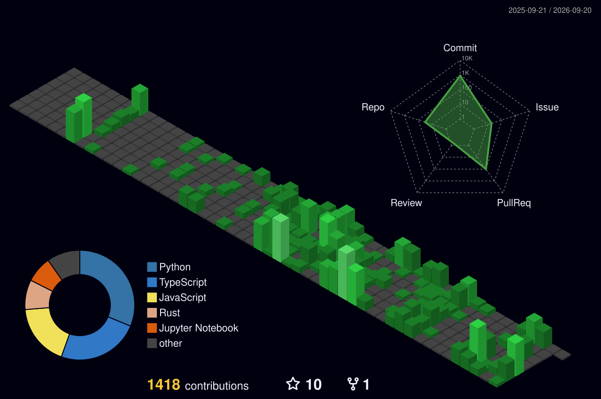

# Hi there 👋, I'm Benjamin

## About Me 😀

- Linkedin: https://www.linkedin.com/in/benbarreraa/
- Hi, I’m Ben, a CS student at the University of South Florida focused on **backend infrastructure and distributed systems**.
- Over multiple internships, I’ve worked on **Java-based backend services, event-driven pipelines, and nearline data processing systems** across fintech, AI platforms, and military technology.
- I’m currently most interested in **scaling, event handling, streaming systems, and data movement problems**.
- I still enjoy building full-stack projects when useful, but my main focus is on **infrastructure and systems-level work**.

## Tech Stack ;)

### Languages

  
  
  
  
  
  
  

### Backend & Frameworks

  
  
  
  

### Distributed Systems & Data

  
  

### Cloud & Infrastructure

  
  
  
  
  
  

## 3D Contributions

  

